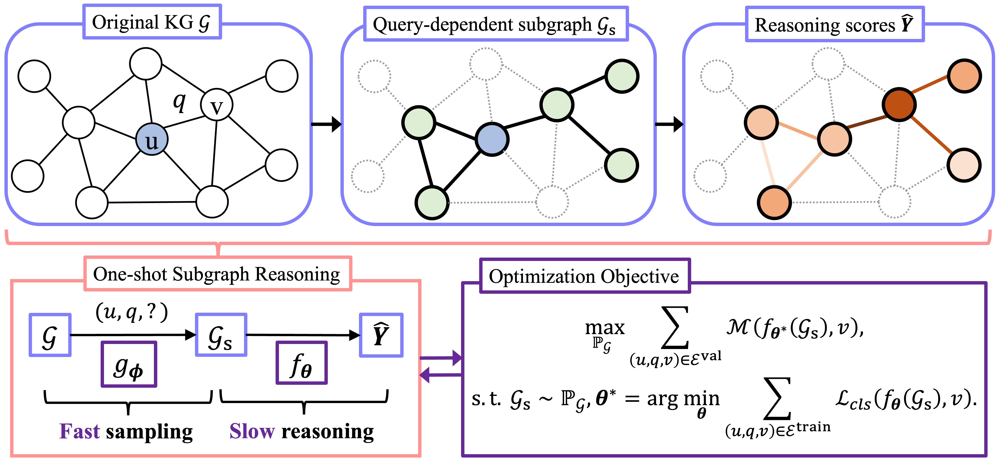

# One-shot Subgraph Reasoning

Official code for the paper "Less is More: One-shot Subgraph Reasoning on Large-scale Knowledge Graphs" (ICLR 2024).

## Introduction

**Background:** To deduce new facts on a knowledge graph (KG), a link predictor learns from the graph structure and collects local evidence to find the answer to a given query. However, existing methods suffer from a severe scalability problem due to the utilization of the whole KG for prediction, which hinders their promise on large scale KGs and cannot be directly addressed by vanilla sampling methods. 

**Design:** In this work, we propose the one-shot-subgraph link prediction to achieve efficient and adaptive prediction. The design principle is that, instead of directly acting on the whole KG, the prediction procedure is decoupled into two steps (as shown below), i.e., 
- (i) extracting only one subgraph according to the query 
- (ii) predicting on this single, query dependent subgraph. 



**Contributions:** We reveal that the non-parametric and computation-efficient heuristics Personalized PageRank (PPR) can effectively identify the potential answers and supporting evidence. With efficient subgraph-based prediction, we further introduce the automated searching of the optimal configurations in both data and model spaces.

## Dependencies
- torch
- torch_scatter
- numpy
- scipy
- sklearn
- networkx
- tqdm
- pickle

Specifically, in experiments, we use torch 2.2.1, torch_scatte 2.1.2+pt22cu121, numpy 1.26.4, scipy 1.12.0, sklearn 1.4.1.post1, and networkx 3.2.1.

## Implementation of PPR

Details can be found in function `PPR_sampler.py/generatePPRScoresForOneEntity()`.

Method-1: using network-x

```python
scores = nx.pagerank(self.homoTrainGraph, personalization={h: 1})
```

Method-2: using matrix computation (much faster)

```python
alpha, iteration = 0.85, 100
scores = torch.zeros(1, self.n_ent).cuda()
s = torch.zeros(1, self.n_ent).cuda()
s[0, h] = 1
for i in range(iteration):
    scores = alpha * s + (1 - alpha) * torch.matmul(scores, self.PPR_W)            
scores = scores.cpu().reshape(-1).numpy()
```

Notably, the program will generate the PPR scores before training or inference. This will be automatically done. The ppr scores will be saved in the crossponding dataset folder and can be directly used in follow-up experiments without regeneration.

## Reproduction by saved checkpoints

WN18RR dataset:
(it will take ~2 hours and ~19 GB in preparing the PPR scores)
```
python3 train_auto.py --data_path ./data/WN18RR/ --batchsize 16 --only_eval --gpu 0 --topk 0.1 --topm -1 --weight ./savedModels/WN18RR_topk_0.1_layer_6_ValMRR_0.569.pt
```
Result:
[VALID] MRR:0.5689 H@1:0.5168 H@10:0.6663        [TEST] MRR:0.5677 H@1:0.5140 H@10:0.6662       [TIME] train:0.0000 inference:439.6239

NELL995 dataset:
(it will take ~8 hours and ~64 GB in preparing the PPR scores)
```
python3 train_auto.py --data_path ./data/nell --batchsize 16 --only_eval --gpu 0 --topk 0.1 --topm -1 --weight ./savedModels/nell_topk_0.1_layer_8_ValMRR_0.505.pt
```
Result:
[VALID] MRR:0.5051 H@1:0.4355 H@10:0.6133        [TEST] MRR:0.5472 H@1:0.4847 H@10:0.6508       [TIME] train:0.0000 inference:337.6629

YAGO3-10 dataset:
(it will take ~80 hours and ~184 GB in preparing the PPR scores)
```
python3 train_auto.py --data_path ./data/YAGO --batchsize 16 --only_eval --gpu 0 --topk 0.1 --topm -1 --weight ./savedModels/YAGO_topk_0.1_layer_6_ValMRR_0.611.pt
```
Result:
[VALID] MRR:0.6117 H@1:0.5477 H@10:0.7273        [TEST] MRR:0.6064 H@1:0.5403 H@10:0.7218       [TIME] train:0.0000 inference:3723.6907

## Reproduction by training from scratch

WN18RR dataset:
```
python3 train_auto.py --data_path ./data/WN18RR/ --batchsize 16 --gpu 0 --topk 0.1 --topm -1  --fact_ratio 0.95
```

NELL995 dataset:
```
python3 train_auto.py --data_path ./data/nell --batchsize 8 --gpu 0 --topk 0.1 --topm -1  --fact_ratio 0.95
```

YAGO3-10 dataset:
```
python3 train_auto.py --data_path ./data/YAGO --batchsize 4 --gpu 0 --topk 0.1 --topm -1 --fact_ratio 0.995
```

## Results

| dataset  | Test MRR | Test Hit@1 | Test Hit@10 |
| -------- | -------- | ---------- | ----------- |
| WN18RR   | 0.5677   | 0.5140     | 0.6662      |
| NELL995  | 0.5472   | 0.4847     | 0.6508      |
| YAGO3-10 | 0.6064   | 0.5403     | 0.7218      |


## Hyper-parameter searching

Taking WN18RR as an example, we run the searching of hyper-parameter by: 
```
python3 search_auto.py --data_path ./data/WN18RR/  --gpu 0 --topk 0.1 --cpu 2 --fact_ratio 0.95 --batchsize 16 --search
```

This script shows the searched hyper-parameters:
```
python3 showResults.py --file ./results/WN18RR/search_log.pkl
```

## Citation

If you find this repository useful in your research, please kindly cite our paper.

```
@inproceedings{zhou2024less,
    title       = {Less is More: One-shot Subgraph Reasoning on Large-scale Knowledge Graphs},
    author      = {Zhanke Zhou and Yongqi Zhang and Jiangchao Yao and Quanming Yao and Bo Han},
    booktitle   = {The Twelfth International Conference on Learning Representations},
    year        = {2024}
}
```

## Reference papers
We also recommend these paper for reference.
- ``KDD 2023`` Adaprop: Learning Adaptive Propagation for Graph Neural Network Based Knowledge Graph Reasoning. [[paper]](https://arxiv.org/pdf/2205.15319.pdf) [[code]](https://github.com/LARS-research/AdaProp)
- ``ACL 2022`` KGTuner: Efficient Hyper-parameter Search for Knowledge Graph Learning. [[paper]](https://arxiv.org/pdf/2205.02460.pdf) [[code]](https://github.com/LARS-research/KGTuner)
- ``WebConf 2022`` Knowledge Graph Reasoning with Relational Digraph. [[paper]](https://arxiv.org/pdf/2108.06040.pdf) [[code]](https://github.com/LARS-research/RED-GNN)

